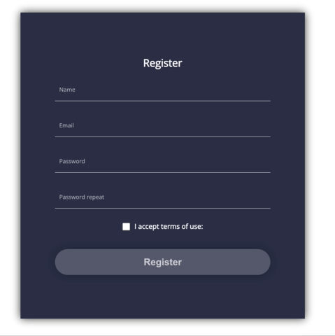

# React Sign Up Page
Tutorial URL: https://www.youtube.com/watch?v=ALy5Srt4R9E
Tutorial description: In this video we build a sign up page in react with hooks. First we build the register form and add styling to it. After that we add state management with the useReducer React hook and then we also add some input validation.

___________

### Software versions

### Problems in the project:
1. Syntax Error: 'return' outside of function. 
	In JavaScript you can put a return statement outside the if statement so I didn't know how to fix this problem at first so I rewritten the function and compared the last one to the rewritten one and noticed I missed a bracket after the if statement wrapped in parenthesis.
	Causing problem:
	Right if statement with both brackets
	```
	if(a === b) {

	}
	````
	```
	Wrong if statement missing one bracket
	if(a === b) 

	}
	```
2. Color won't change.
	First, the password must be greater than 3 characters for the boolean to pass as true. Second, I put the the second password name's attribute as 'PasswordInput' while the function is expecting an input's name attribute as PasswordRepeat and not as 'PasswordInput'
	
	```
	// this object has a key 'passwordRepeat' and is saving the form's data. There is no 'passwordInput'
	//
	const initialState = {
	  name: '',
	  email: '',
	  password: '',
	  passwordRepeat: '',
	  termsAccepted: false
	}
			// name is as 'passwordInput' and not as passwordRepeat
			// 
	      	<input 
                className="TextInput"
                type="password"
                name="passwordInput"
                placeholder="Password repeat"
                onChange={onChange}
            />
	```

### How to use

### Photos of project:


### Apps used:
Sublime Text: [https://www.sublimetext.com/](https://www.sublimetext.com/)
Tabby: [https://tabby.sh/](https://tabby.sh/) 

GitHub CLI: [https://cli.github.com/](https://cli.github.com/) 


### Coding styles I used:
Indented attributes
```
	// Wrong
     <input className="TextInput" type="password" name="passwordInput" placeholder="Password repeat"
     />

     // Right
          	<input 
                className="TextInput"
                type="password"
                name="passwordInput"
                placeholder="Password repeat"
            />
```

### What I learned
1. How you can build a nicely designed sign up page in ReactJS with the entire CSS language available in the library. Without a web server and using only 2 files (index.html and a .css file) it's rather rough. With ReactJS It comes with a built-in auto-reloading server. Though it's component based and the library hides the body element, simply build the site inside the default App.js & App.css files it's pre-created with in create-react-app.